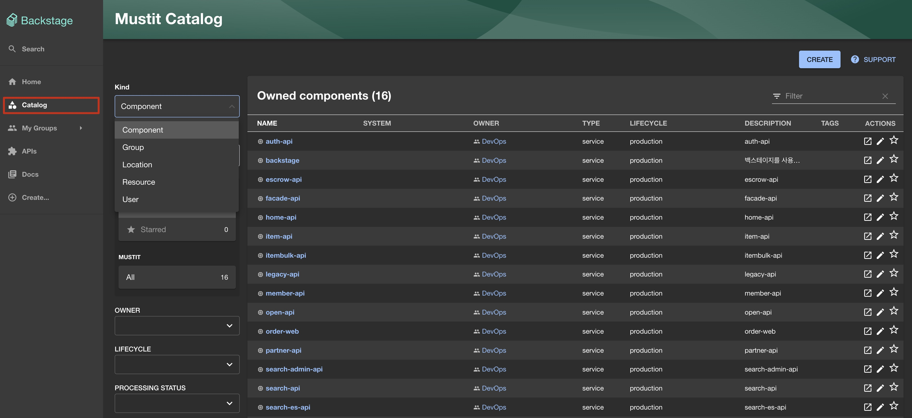

# Catalog

백스테이지의 카탈로그는 개발자들이 개발에 필요한 모든 요소들을 추적, 관리할 수 있도록 돕고 있습니다.

카탈로그 단위는 컴포넌트(Component), 시스템(System), API(API), 리소스(Resource), 위치(Location) 등이 있습니다.

각 단위에 대한 설명은 다음과 같습니다.

## 컴포넌트(Component)
---
* 컴포넌트 목록 화면

컴포넌트는 개발 단위에 해당하는 요소들을 통합, 추적, 관리할 수 있도록 돕고 있습니다.

**backstage-portfolio** 프로젝트, **springboot-app** 등을 컴포넌트로 관리할 수 있도록 구성하고 있습니다.

### Overview
* 컴포넌트 오버뷰(Overview) 화면

컴포넌트는 카탈로그 오버뷰 화면을 제공합니다. 컴포넌트 오버뷰 화면에서는 컴포넌트의 개요, 소유자, 소스코드, 문서, 대시보드 등을 확인할 수 있습니다.

Links 탭에서는 해당 컴포넌트에 대한 Github Repo, Jenkins Job, ArgoCD App 등을 확인할 수 있습니다.

### ArgoCD
* 컴포넌트 ArgoCD 화면

* ArgoCD 애플리케이션 디테일 및 대시보드 링크

ArgoCD 탭에서는 해당 컴포넌트에 대한 ArgoCD App 정보를 확인할 수 있습니다.
최근 5개의 애플리케이션 히스토리를 확인할 수 있습니다.
또한 ArgoCD 애플리케이션 이름을 클릭하면 ArgoCD에서 등록된 상세 정보를 확인할 수 있으며 ArgoCD 대시보드 화면으로 이동할 수 있습니다.

현재 ArgoCD 탭은 **Prod** 환경에 대해서만 제공하고 있습니다.
ArgoCD Dev 환경에 대한 정보는 Overview 탭에서 제공하는 Links 를 통해서 접근할 수 있도록 제공하고 있습니다.

### Kubernetes
* 컴포넌트 Kubernetes 화면

* Kubernetes 디테일 화면 (Yaml확인, Logs 확인, 디테일 화면 이동)

Kubernetes 탭에서는 해당 컴포넌트에 대한 Kubernetes 정보를 확인할 수 있습니다.

### API
* 컴포넌트 API 화면

API 탭에서는 해당 컴포넌트에 대한 API 정보를 확인할 수 있습니다.
Provided API는 컴포넌트에서 제공하는 API 정보를 확인할 수 있습니다.
Consumed API는 컴포넌트에서 사용하는 API 정보를 확인할 수 있습니다.
아직 구현되지 않은 기능이므로 추후 업데이트 예정입니다.

### Docs
* 컴포넌트 Docs 화면

Docs 탭에서는 해당 컴포넌트에 대한 문서 정보를 확인할 수 있습니다.
문서 정보의 경우 md 파일을 통해서 각 컴포넌트를 관리하는 개발자가 관련한 기술 내용을 작성해 나갈 수 있도록 구현된 기능입니다.
지정된 Repository 에서 지속적으로 문서를 관리해 나갈 수 있습니다.
하지만 내부적인 문서 관리 방법에 대한 정책이 없는 상황이므로 해당 기능을 사용하고자 한다면 적극 도입 예정 입니다.

## 시스템(System)
---
* 시스템 목록 화면

시스템은 개발 단위에 해당하는 요소들을 통합, 추적, 관리할 수 있도록 돕고 있습니다.
